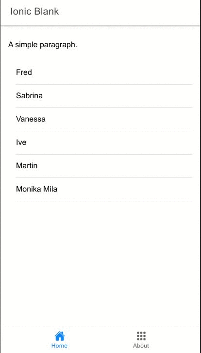

<h1 align="center">
   
 </a>
   
  Ionic 5 & React -  Starter Template
   
</h1>

<h4 align="center">
A simple starter template for <a href="https://ionicframework.com/">Ionic</a>, <a href="https://reactjs.org/">React</a> and <a href="https://www.typescriptlang.org/">TypeScript</a></h4>

  
  
  
  

## How To Use

- `npm start` to start the devServer
- `npm run build` to build the production ready code to the /dist folder

## Demo

</a>
